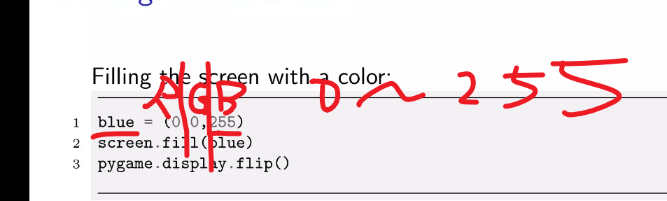

# jiakuanghe.github.io

Computer Science Introduction: [Crash Course Computer Science Preview - YouTube](https://www.youtube.com/watch?v=tpIctyqH29Q&list=PLH2l6uzC4UEW0s7-KewFLBC1D0l6XRfye)


```java
System.out.println();
// shortcut
syso
```


## Summer 2024 Internship

[GitHub - SimplifyJobs/Summer2024-Internships: Collection of Summer 2024 tech internships!](https://github.com/SimplifyJobs/Summer2024-Internships)

[2023-2024 Tech Internship Guide & Salaries | Levels.fyi](https://www.levels.fyi/internships/)


## Summer 2023 Internship

[https://github.com/pittcsc/Summer2023-Internships](https://github.com/pittcsc/Summer2023-Internships)


## AI Club's Meeting Totes

### 11/7/2023

[Markdown](./markdown/markdown-syntax.md)


### 03/20/2023

#### AI News

[Introducing Microsoft 365 Copilot](https://www.microsoft.com/en-us/microsoft-365/blog/2023/03/16/introducing-microsoft-365-copilot-a-whole-new-way-to-work/)

[Free Software](https://www.ccsf.edu/about-ccsf/administration/finance-and-administration/information-technology-services/free-software)


Linux Command

[Where To Use Linux Command](./linux/where-to-use-linux-command)

[Some Frequently Used Linux Command](./linux/some-frequently-used-linux-command)

[How To Change The Default File Called Main On Replit](./linux/how-to-change-the-default-file-called-main-on-replit)


### 04/03/2023

#### AI News

[GPT-4 (openai.com)](https://openai.com/research/gpt-4)

[Introducing GitHub Copilot X](https://github.com/features/preview/copilot-x)

[Cursor](https://www.cursor.so/)


### 04/10/2023

#### Schools News

[Summer 2023 Classes](https://www.ccsf.edu/academics/class-schedule)


Computer Processing

- Memory

- Hardware

- Software

[https://docs.google.com/presentation/d/1ESQT722ujX0xAa3mEsL74EsCtMCDRuF0/edit?usp=sharing&ouid=104217728810751978758&rtpof=true&sd=true](https://docs.google.com/presentation/d/1ESQT722ujX0xAa3mEsL74EsCtMCDRuF0/edit?usp=sharing&ouid=104217728810751978758&rtpof=true&sd=true)


### 04/17/2023

#### School News

Fall Course 2023: [Class Schedule | CCSF](https://www.ccsf.edu/academics/class-schedule)


### 04/24/2023 Computer Network

#### AI News

Auto GPT: [https://github.com/Significant-Gravitas/Auto-GPT](https://github.com/Significant-Gravitas/Auto-GPT)

Slide: [https://docs.google.com/presentation/d/1ESQT722ujX0xAa3mEsL74EsCtMCDRuF0/edit?usp=sharing&ouid=104217728810751978758&rtpof=true&sd=true](https://docs.google.com/presentation/d/1ESQT722ujX0xAa3mEsL74EsCtMCDRuF0/edit?usp=sharing&ouid=104217728810751978758&rtpof=true&sd=true)


draw Diagram: [https://draw.io](https://draw.io)


### 05/01/2023 Git

Slides: [https://www.slideshare.net/bcbbslides/introduction-to-git-and-github-72514916](https://www.slideshare.net/bcbbslides/introduction-to-git-and-github-72514916)

#### School News

We can begin to register for the fall class


### 05/08 Pygame

[snake ai club - Replit](https://replit.com/@JasonAvina/snake-ai-club?v=1#main.py)

https://www.slideshare.net/Felix11H/pygame-presentation




### SSH

[What Is SSH](./linux/what-is-ssh)

[How To Use SSH To Login](./linux/how-to-use-ssh-to-login)

[How To Use SCP To Transfer File](./linux/how-to-use-scp-to-transfer-file)


## Projects

[How To Build A Discord Robot](./projects/how-to-build-a-discord-robot)


## Debugger

[What is debugger?](./debugger/what-is-debugger)

[How to debug - Python](./debugger/how-to-debug-python)

[How to debug - Java](./debugger/how-to-debug-java)

[How to debug - C++](./debugger/how-to-debug-cpp)


## Candidate Topic

git

Pygame

