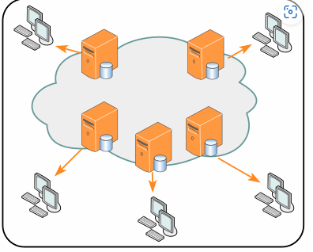

# DDoS

## Intro

[Denial-of-service attack - Wikipedia](https://en.wikipedia.org/wiki/Denial-of-service_attack#Distributed_DoS)

In [computing](https://en.wikipedia.org/wiki/Computing), a **denial-of-service attack** (**DoS attack**) is a [cyber-attack](https://en.wikipedia.org/wiki/Cyber-attack) in which the perpetrator seeks to make a machine or network resource unavailable to its intended [users](https://en.wikipedia.org/wiki/User_(computing)) by temporarily or indefinitely disrupting [services](https://en.wikipedia.org/wiki/Network_service) of a [host](https://en.wikipedia.org/wiki/Host_(network)) connected to a [network](https://en.wikipedia.org/wiki/Computer_network). Denial of service is typically accomplished by [flooding](https://en.wikipedia.org/wiki/Flooding_(computer_networking)) the targeted machine or resource with superfluous requests in an attempt to overload systems and prevent some or all legitimate requests from being fulfilled.

## CC Attack

A Challenge Collapsar (CC) attack is an attack where standard HTTP requests are sent to a targeted web server frequently. The [Uniform Resource Identifiers](https://en.wikipedia.org/wiki/Uniform_Resource_Identifier) (URIs) in the requests require complicated time-consuming algorithms or database operations which may exhaust the resources of the targeted web server.[[60\]](https://en.wikipedia.org/wiki/Denial-of-service_attack#cite_note-60)[[61\]](https://en.wikipedia.org/wiki/Denial-of-service_attack#cite_note-61)[[62\]](https://en.wikipedia.org/wiki/Denial-of-service_attack#cite_note-62)

In 2004, a Chinese hacker nicknamed KiKi invented a hacking tool to send these kinds of requests to attack a NSFOCUS firewall named *Collapsar*, and thus the hacking tool was known as *Challenge Collapsar*, or *CC* for short. Consequently, this type of attack got the name *CC attack*.[[63\]](https://en.wikipedia.org/wiki/Denial-of-service_attack#cite_note-63)

## ICMP Attack

### Internet Control Message Protocol (ICMP) flood[[edit](https://en.wikipedia.org/w/index.php?title=Denial-of-service_attack&action=edit&section=20)]

A [smurf attack](https://en.wikipedia.org/wiki/Smurf_attack) relies on misconfigured network devices that allow packets to be sent to all computer hosts on a particular network via the [broadcast address](https://en.wikipedia.org/wiki/Broadcast_address) of the network, rather than a specific machine. The attacker will send large numbers of [IP](https://en.wikipedia.org/wiki/Internet_Protocol) packets with the source address faked to appear to be the address of the victim.[[64\]](https://en.wikipedia.org/wiki/Denial-of-service_attack#cite_note-64) Most devices on a network will, by default, respond to this by sending a reply to the source IP address. If the number of machines on the network that receive and respond to these packets is very large, the victim's computer will be flooded with traffic. This overloads the victim's computer and can even make it unusable during such an attack.[[65\]](https://en.wikipedia.org/wiki/Denial-of-service_attack#cite_note-ANML-DDoS-65)

[Ping flood](https://en.wikipedia.org/wiki/Ping_flood) is based on sending the victim an overwhelming number of [ping](https://en.wikipedia.org/wiki/Ping_(networking_utility)) packets, usually using the *ping* command from [Unix-like](https://en.wikipedia.org/wiki/Unix-like) hosts.[[a\]](https://en.wikipedia.org/wiki/Denial-of-service_attack#cite_note-66) It is very simple to launch, the primary requirement being access to greater [bandwidth](https://en.wikipedia.org/wiki/Bandwidth_(computing)) than the victim.

[Ping of death](https://en.wikipedia.org/wiki/Ping_of_death) is based on sending the victim a malformed ping packet, which will lead to a system crash on a vulnerable system.

The [BlackNurse](https://en.wikipedia.org/wiki/BlackNurse_(Computer_Security)) attack is an example of an attack taking advantage of the required Destination Port Unreachable ICMP packets.

## Cloudflare

**Cloudflare, Inc.** is an American company that provides [content delivery network](https://en.wikipedia.org/wiki/Content_delivery_network) services, cloud cybersecurity, [DDoS mitigation](https://en.wikipedia.org/wiki/DDoS_mitigation), and [ICANN](https://en.wikipedia.org/wiki/ICANN)-accredited[[3\]](https://en.wikipedia.org/wiki/Cloudflare#cite_note-3) [domain registration services](https://en.wikipedia.org/wiki/Domain_name_registrar).[[4\]](https://en.wikipedia.org/wiki/Cloudflare#cite_note-CNBC-4)[[5\]](https://en.wikipedia.org/wiki/Cloudflare#cite_note-thinking-big-5)[[6\]](https://en.wikipedia.org/wiki/Cloudflare#cite_note-6) Cloudflare's headquarters are located in San Francisco, California.[[4\]](https://en.wikipedia.org/wiki/Cloudflare#cite_note-CNBC-4) According to *[The Hill](https://en.wikipedia.org/wiki/The_Hill_(newspaper))*, it is used by more than 20 percent of the Internet for its web security services as of 2022.[[7\]](https://en.wikipedia.org/wiki/Cloudflare#cite_note-7)

## CDN (Content delivery network)

[Content delivery network - Wikipedia](https://en.wikipedia.org/wiki/Content_delivery_network)

A **content delivery network**, or **content distribution network** (**CDN**), is a geographically distributed network of [proxy servers](https://en.wikipedia.org/wiki/Proxy_server) and their [data centers](https://en.wikipedia.org/wiki/Data_center).

