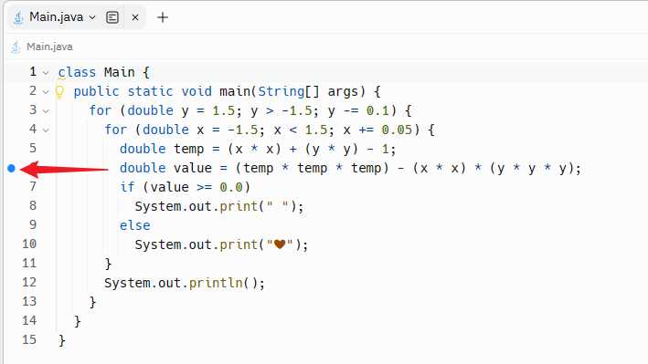

# How To Debug - Java

Other Online IDE: [Online Java Debugger - online editor (onlinegdb.com)](https://www.onlinegdb.com/online_java_debugger)


## Practice Code

The following code doesn't get the expected result.

You need to use the debug technique to find why it doesn't working correctly.

```
```


### Expected


### Real


## Challenge Code

Draw a heart shape.

The heart shape equation is:

```
(x^2+y^2-1)^3-x^2*y^3=0
```


Use the following code and use the debug technique to find where need to fix:

```java
class Main {
  public static void main(String[] args) {
    for (double y = 1.5; y > -1.5; y -= 0.1) {
      for (double x = -1.5; x < 1.5; x += 0.05) {
        double temp = (x * x) + (y * y) - 1;
        double value = (temp * temp * temp) - (x * x) * (y * y * y);
        if (value == 0.0)// Fix me
          System.out.print(" ");
        else
          System.out.print("❤");
      }
      System.out.println();
    }
  }
}
```

>Answer:
>
>```java
>class Main {
>  public static void main(String[] args) {
>    for (double y = 1.5; y > -1.5; y -= 0.1) {
>      for (double x = -1.5; x < 1.5; x += 0.05) {
>        double temp = (x * x) + (y * y) - 1;
>        double value = (temp * temp * temp) - (x * x) * (y * y * y);
>        if (value >= 0.0)
>          System.out.print(" ");
>        else
>          System.out.print("❤");
>      }
>      System.out.println();
>    }
>  }
>}
>```


### Expected


### Real


## Debug With Replit

1. Find the debugger button on the left side `Tools`

	


2. Create a `breakpoint`, click the left side of the line column.

	


3. Click the `Run` button.

​		


4. On the debugger Tab, click the blue `Run` button.


> On replit, you should run the programm first. Then, use the debugger.
>
> Because replit use the command `Debug (sh -c java-debug)` to debug the running command.


## Reference

[Desmos | Graphing Calculator](https://www.desmos.com/calculator)

