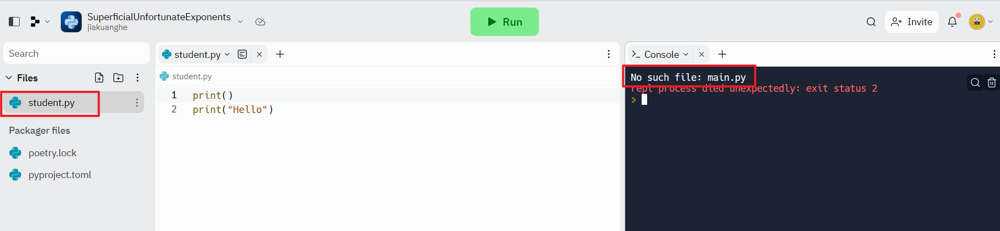
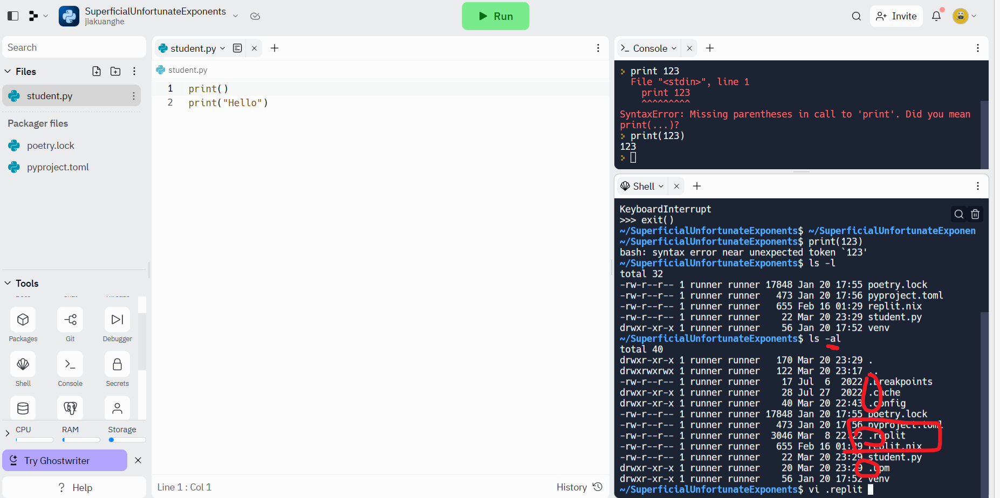
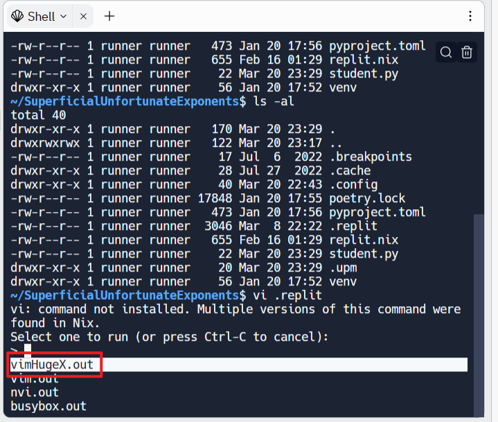
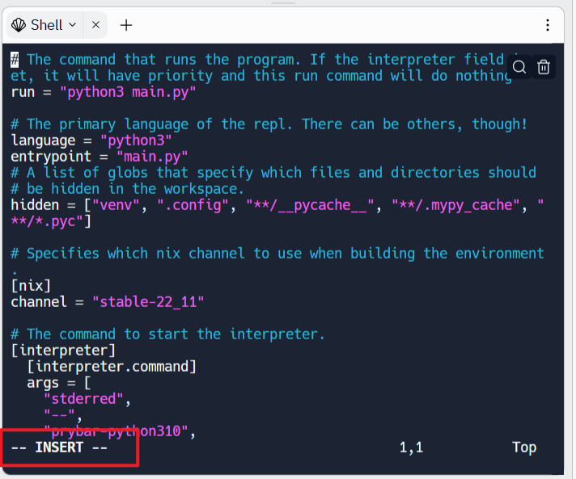
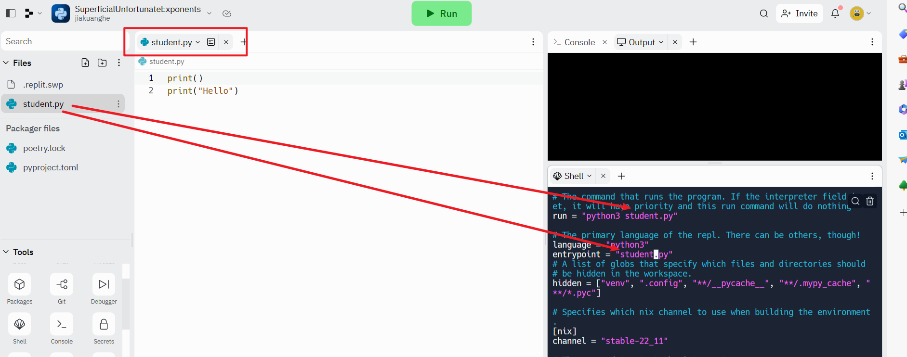
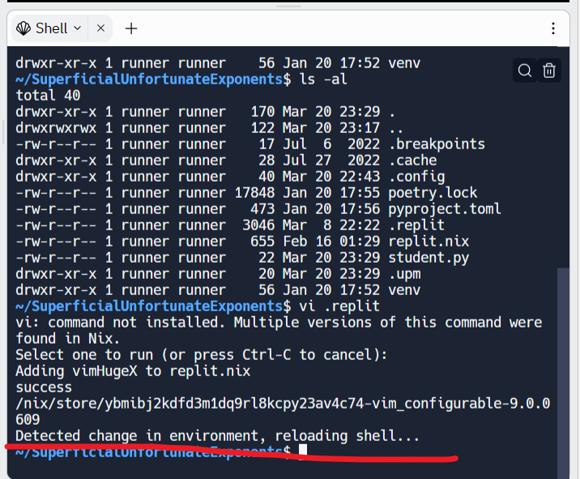
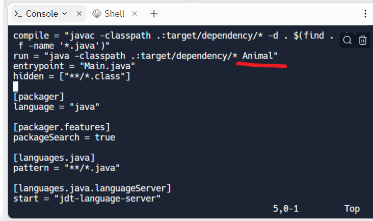
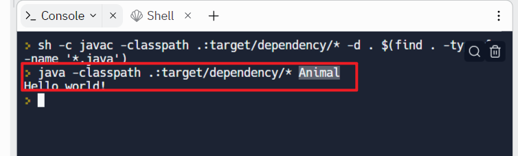
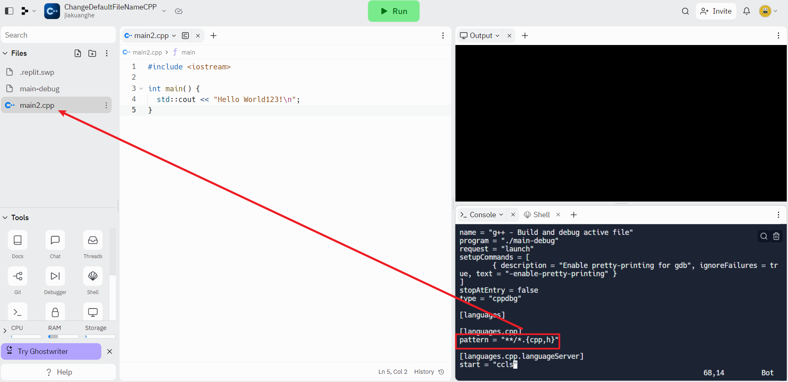
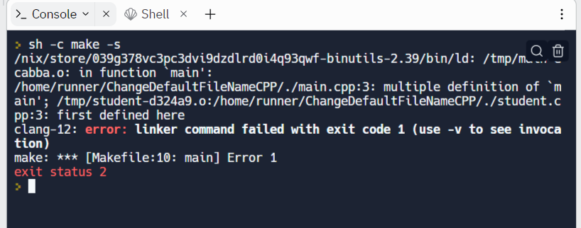

# How To Change The Default File Called Main On Replit






```bash
vi .replit
```



Press down `enter` to use the default editor.

## Way1: Steps to edit the default file called main

	1. `i`

   

	2. Edit the file name

   

   3. go to the normal mode, press down the `esc`

   4. Write and quit the file `:wq`

   5. press `enter` key again

      


## Way2: Run the file with the `Python` command

```bash
python student.py
```

> student.py is related to the file you just rename it


## How to change Java default file name

### Method 1: change the default configuration





### Method 2: compile and run by using the command

```bash
javac Animal.java
java Animal
```

#### How Java Cross Platform

.png)


## How to change C++ default file name

Don't need to change the configuration.



If we have two files, and both have main method, we will get the compile errors.


