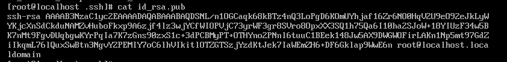

# How To Use SSH To Login

```bash
ssh username@server
```

### Example

```bash
ssh root@10.1.0.101
```


If we press `no`, the ssh will disconnect.


For safety reason, any input here will not be shown.


## Permission denied, please try again.

If the password is wrong, you will get the tips `Permission denied, please try again.`


## Passwordless login

###  1. Create a ssh key

   ```bash
   ssh-keygen
   ```

   Press down enter to save the default directory

   


### 2. ssh-copy-id

```bash
ssh-copy-id username@server_ip
```


### How they work

Server 10.1.0.101



Connected Server 10.1.0.102


## RSA

RSA (Rivest–Shamir–Adleman) is a public-key cryptosystem that is widely used for secure data transmission.

[RSA (cryptosystem) - Wikipedia](https://en.wikipedia.org/wiki/RSA_(cryptosystem))


## public key and private key

In a public-key cryptosystem, the encryption key is public and distinct from the decryption key, which is kept secret (private).

public key: send to others, can be public

private key: secret key, we need to make it safe

