# Some Frequently Used Linux Command

## man

used to check for description and arguments for the command

### Example

```bash
man ls
```

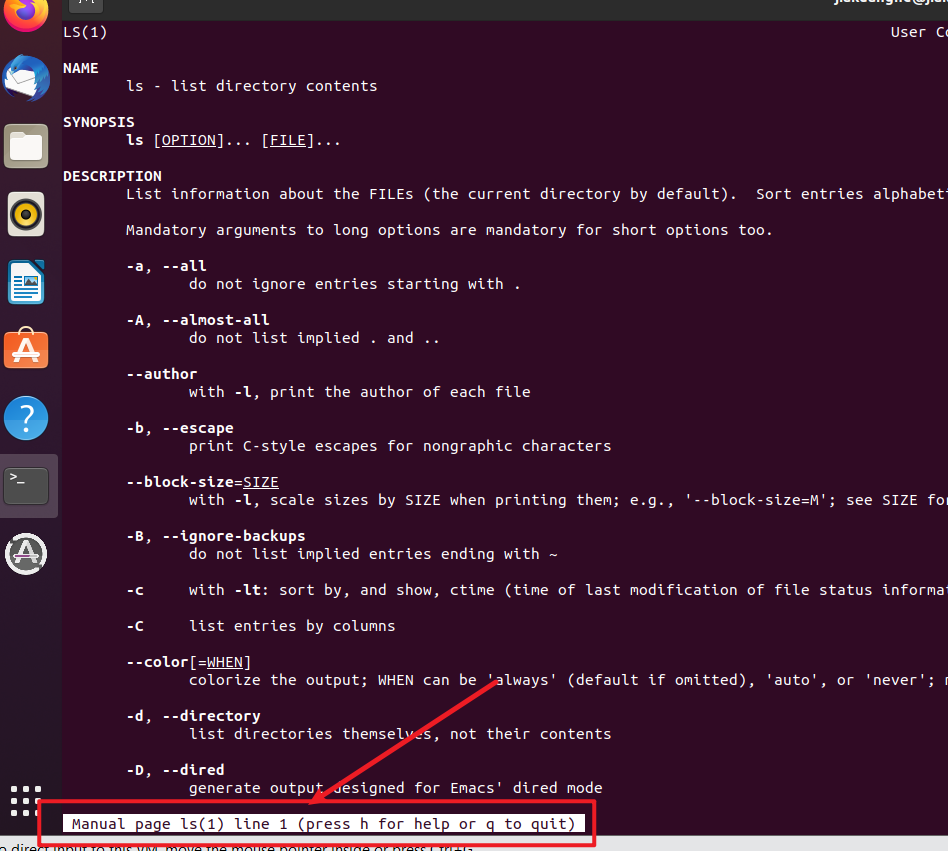


## ls

list directories and files contents

### Example

```bash
ls
```

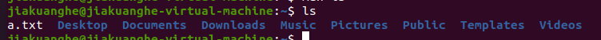


### -l

use a long listing format

### Example

```bash
ls -l
```

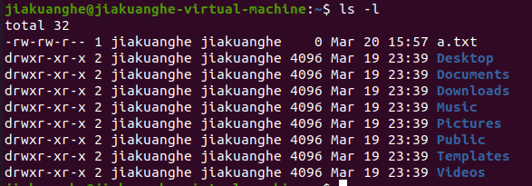


## date

### Exanple

```bash
date
```

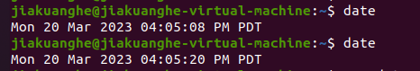


## vi

VI is an editor to edit the file content.

### Example

```bash
vi a.txt
```

> You need to make sure you have a.txt file. If you haven't, you need to create it first.
>
> You only need to execute command first time.
>
> ```bash
> touch a.txt
> ```


### mode

#### Normal Mode

When you use `vi` to open/edit the file, you enter the normal mode.

Press down `esc` in any mode (on the left upper conner, one key) command to go back to the Normal Mode.


#### Insert Mode

If you want to edit the file, you need to use the Insert Mode.

Use `i` to enter the Insert Mode.


#### **Command-line** or **Cmdline** mode

If you want to use some command, you need to use in this mode.

use `:` to go the command-line mode.

quit the vi `:q`

write and quit `:wq`

quit without save `:q!` (If you edit anything after you use insert mode, you don't want to save it)

>  If you edit anything in the `vi`, and use the `:q`, the vi command will give you a warning.
>
> 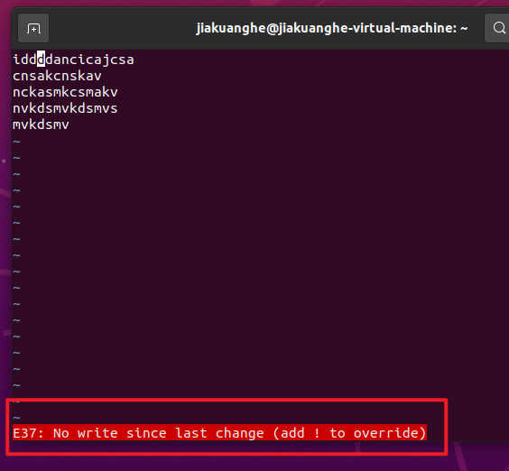


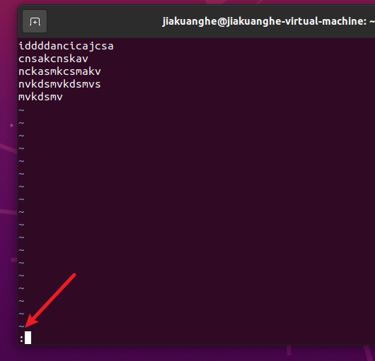


.png)


> References:
>
> [vi - Wikipedia](https://en.wikipedia.org/wiki/Vi)
>
> [vi-vim-cheat-sheet.gif (1024×724) (viemu.com)](http://www.viemu.com/vi-vim-cheat-sheet.gif)
>
> [Vim (text editor) - Wikipedia](https://en.wikipedia.org/wiki/Vim_(text_editor)#Modes)


## rm

abbr: ReMove

used to remove the file or directory

```bash
rm THE_FILE_YOU_WANT_TO_REMOVE
```

Example:

```bash
touch a.txt
rm a.txt
```


## pwd

Print Working Directory

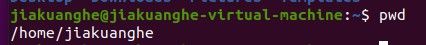


## whoami

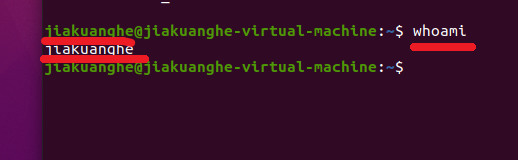


## cd

Change Directory

### Example

```bash
cd Desktop
```

> Use `ls` to check what directory you have first.

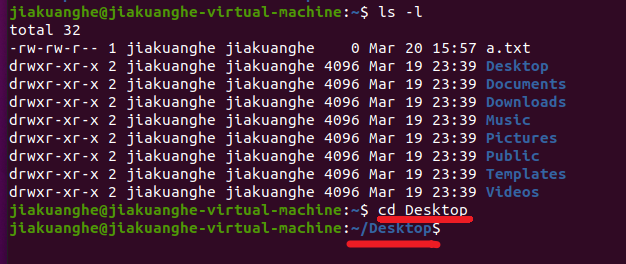


## wget

```
wget https://upload.wikimedia.org/wikipedia/commons/8/80/Cowsay_Typical_Output.png
```


## passwd

```bash
passwd THE_USERNAME_WE_WANT_TO_EDIT_THE_PASSWORD
```

### Example

```bash
passwd root
```


## Some Playful Command

### fortune

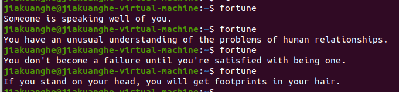


### cowsay

`Welcome to join AIClub` is the content you want to let the cow say.

```bash
cowsay Welcome to join AIClub
```

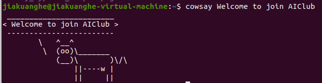


### sl

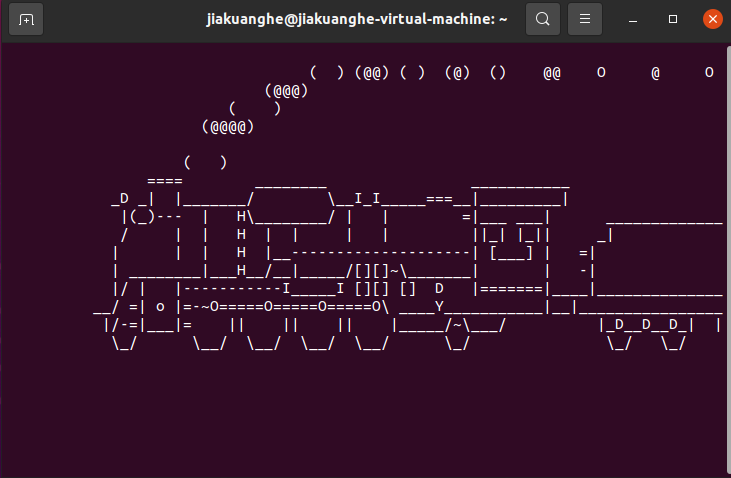