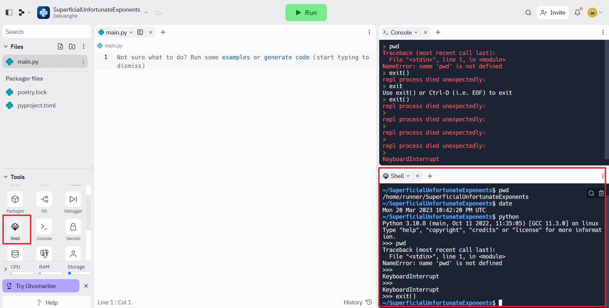

# Where To Use Linux Command

## Way 1: use in bash repl template

## (common) Way2: use in `Shell` on replit

## Way3: use on Windows

on powershell, not the cmd

windows 11: built-in `Terminal`

## Way4: use on macOS

Lanuchpad to find `Terminal`

## Way 5: use on Linux

### Ubuntu

