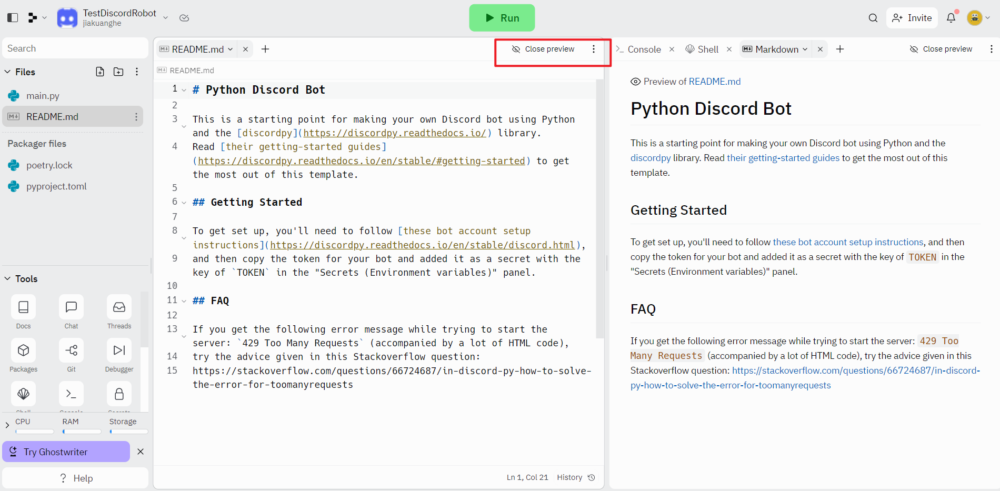

# How To Build A Discord Robot

[Discord Developer Portal — Documentation — Intro](https://discord.com/developers/docs/intro)

[Discord Developer Portal — Documentation — Community Resources](https://discord.com/developers/docs/topics/community-resources)





## How to add a robot to my server


Get the invitation link


## 

## Some Useful API

### How to reply a message

```python
await message.channel.send('Hello!')
```

### How to receive message

```python
@client.event
async def on_message(message):
    if message.author == client.user:
        return

    if message.content.startswith('$hello'):
        await message.channel.send('Hello!')
```

